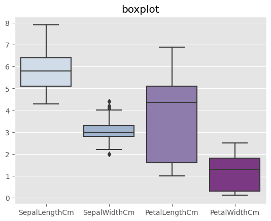
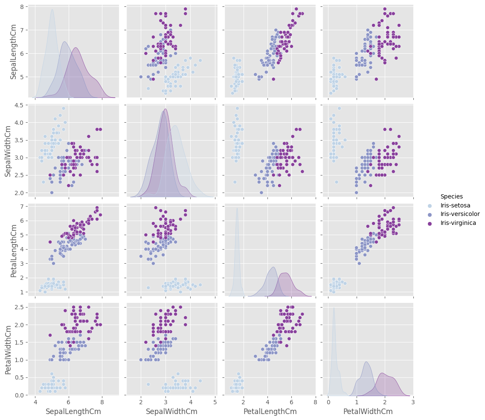

# IrisClassification
Applying Decision Tree, Naive Bayes classification and Logistic Regression. College assignment

### Evaluation
- Decision Tree:
<pre>
Test accuracy: 0.963
Classification report:
                 precision    recall  f1-score   support

    Iris-setosa       1.00      1.00      1.00        10
Iris-versicolor       0.90      1.00      0.95         9
 Iris-virginica       1.00      0.88      0.93         8

       accuracy                           0.96        27
      macro avg       0.97      0.96      0.96        27
   weighted avg       0.97      0.96      0.96        27
</pre>
- LGR:
<pre>
Test accuracy: 1.0
Classification report:
                 precision    recall  f1-score   support

    Iris-setosa       1.00      1.00      1.00        10
Iris-versicolor       1.00      1.00      1.00         9
 Iris-virginica       1.00      1.00      1.00         8

       accuracy                           1.00        27
      macro avg       1.00      1.00      1.00        27
   weighted avg       1.00      1.00      1.00        27
</pre>
- Naive Bayes Classifier:
<pre>
  confisuon matrix: 
 [[10  0  0]
 [ 0  9  1]
 [ 0  0  7]]
accuracy score: 
 0.9629629629629629
classification report: 
               precision    recall  f1-score   support

           0       1.00      1.00      1.00        10
           1       1.00      0.90      0.95        10
           2       0.88      1.00      0.93         7

    accuracy                           0.96        27
   macro avg       0.96      0.97      0.96        27
weighted avg       0.97      0.96      0.96        27
</pre>  
